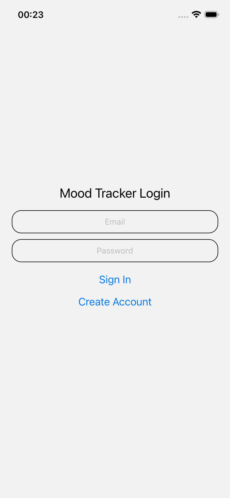
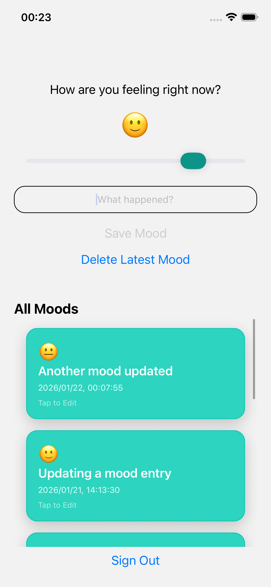
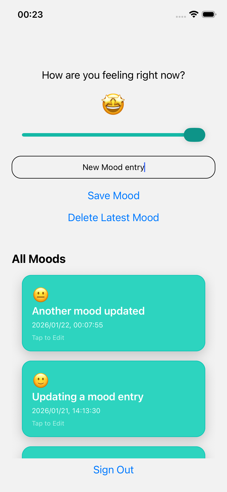
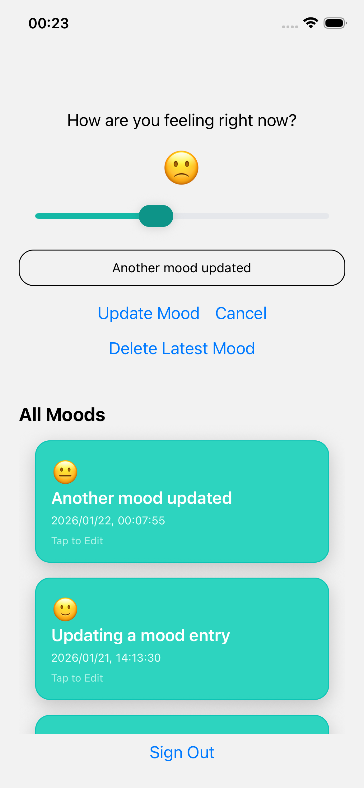
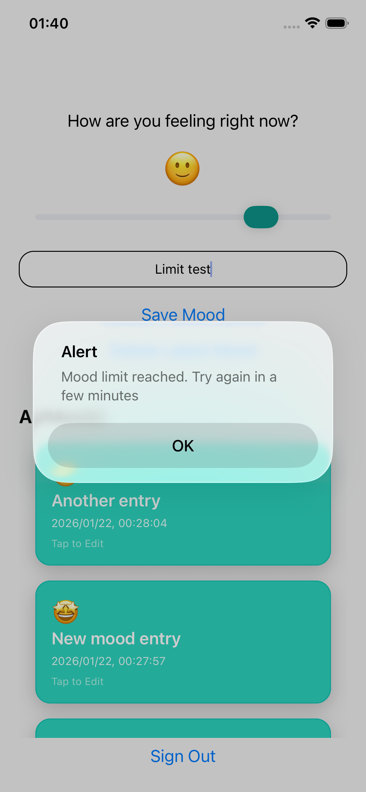
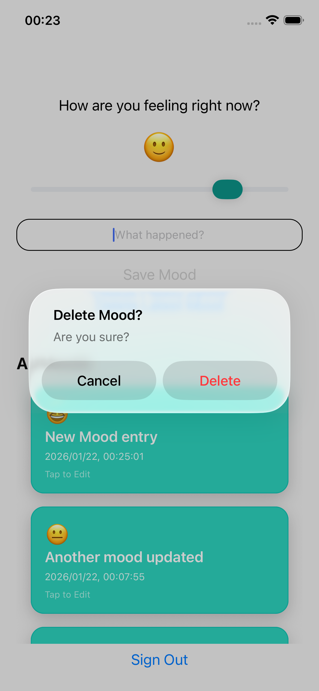

# Mood - A Minimal Mood App Tracker

## Overview

Mood is a cross-platform mobile app built with Expo and Supabase that allows users to log their emotional state with an optional reflection. The project was intentionally designed to be minimal in scope while demonstrating production-ready patterns such as authentication, database-level constraints, and secure, user-scoped data access.

Rather than focusing on feature volume, the app focuses on correctness, data integrity, and clear separation of concerns across the stack.

## Project Status

This project is feature-complete and intended as a portfolio demonstration of end-to-end mobile app development.

## Tech Stack

- Mobile: Expo (React Native)
- Language: TypeScript
- Backend: Supabase (PostgreSQL, Auth)
- Database: PostgreSQL
- Security: Row Level Security (RLS), database triggers & functions
- Tooling: Git, GitHub, VS Code, Bash Terminal

## Features

- User authentication and session-based data access
- Create, update, and delete mood entries
- Mood level selection via a visual slider (0–5) with emoji feedback
- Optional text reflection for each mood entry
- Server-enforced rate limiting to prevent abuse
- Confirmation dialogs for destructive actions
- Typed API layer for safer client–database interaction

## Architecture and Design Decisions

### Database-first constraints

Instead of enforcing rules only on the client, the app uses PostgreSQL triggers and functions to enforce a time-based rate limit on mood creation. This ensures the rule is applied regardless of client behavior and prevents circumvention through deletes or modified requests.

### Secure user-scoped data access

Row Level Security (RLS) policies ensure users can only access and modify their own data. Filtering by user identity happens at the database level, not in the client.

### Typed Supabase helpers

Supabase-generated types are used throughout the API layer to reduce runtime errors and keep the client aligned with the database schema.

### Minimal UI, intentional UX

The interface prioritizes clarity and low friction:

- A single screen with scrollable list of mood entries at the bottom
- A thick and attractive emoji selection slider
- Confirmation alert for destructive action
- No alerts for update and save actions, this saves the users from clicking ok to hide the alert.
- In addition to the save button, a user can also click the return button to save a new entry.

## Screenshots / Demo

### Demo Video

A short screen recording demonstrating mood creation, update, rate limiting, and deletion.

▶️ [Watch demo](assets/demo/mood-app-demo.gif)

<!-- markdownlint-disable MD033 -->
<!-- markdownlint-disable MD045 -->
### Screenshots

  
  
  
  
  

#### Login Screen

### Mood Tracker Default screen

### New Mood Entry

### Update Entry

### Delete Confirmation

### Rate Limit Feedback

## Running the app locally

- git clone <https://github.com/nkolonzilucky/mood-app>
- cd mood-app
- npm install
- npx expo start

## Feature Improvements

- Add a google auth provider
- Add weekly summary stats of the mood levels
- Represent the summary stats as a line graph to track mood swing trends
